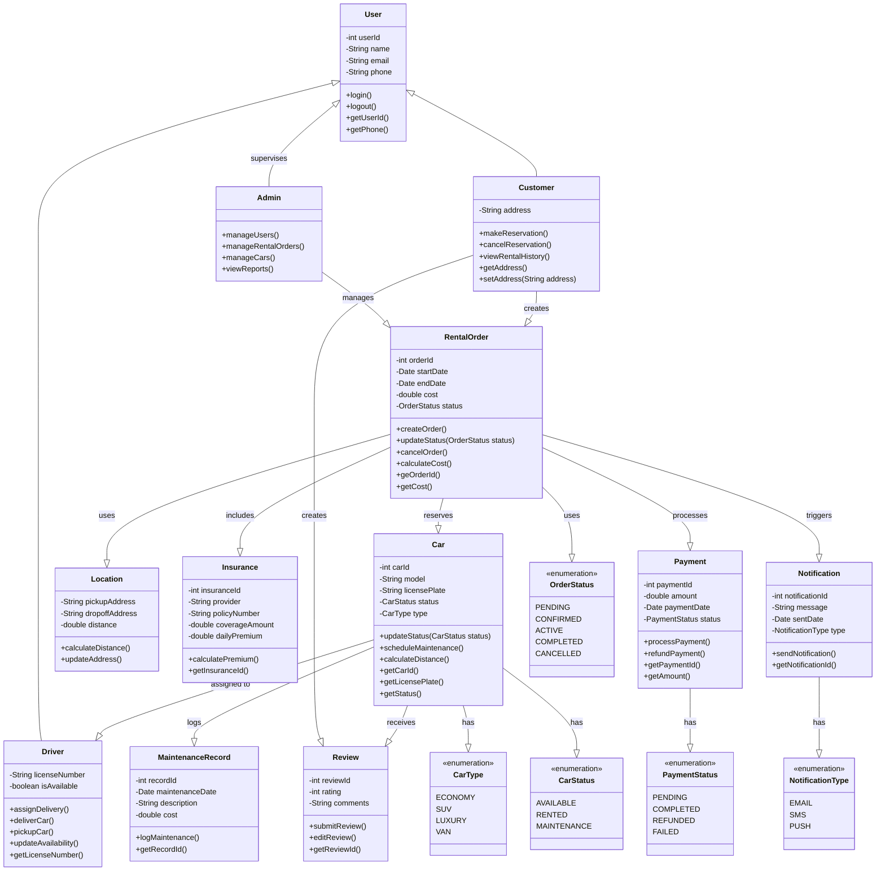

<h1 align="center" id="title">Carhop | Procrasti-nation</h1>

Car rental app made for our CC3 class

<h1 align="center" id="title2">UML DIAGRAM</h1>

```mermaid
classDiagram
    class User {
        -int userId
        -String name
        -String email
        -String phone
        +login()
        +logout()
        +getUserId()
        +getPhone()
    }

    class Admin {
        +manageUsers()
        +manageRentalOrders()
        +manageCars()
        +viewReports()
    }

    class Customer {
        -String address
        +makeReservation()
        +cancelReservation()
        +viewRentalHistory()
        +getAddress()
        +setAddress(String address)
    }

    class Driver {
        -String licenseNumber
        -boolean isAvailable
        +assignDelivery()
        +deliverCar()
        +pickupCar()
        +updateAvailability()
        +getLicenseNumber()
    }

    class Car {
        -int carId
        -String model
        -String licensePlate
        -CarStatus status
        -CarType type
        +updateStatus(CarStatus status)
        +scheduleMaintenance()
        +calculateDistance()
        +getCarId()
        +getLicensePlate()
        +getStatus()
    }

    class Location {
        -String pickupAddress
        -String dropoffAddress
        -double distance
        +calculateDistance()
        +updateAddress()
    }

    class Insurance {
        -int insuranceId
        -String provider
        -String policyNumber
        -double coverageAmount
        -double dailyPremium
        +calculatePremium()
        +getInsuranceId()
    }

    class Payment {
        -int paymentId
        -double amount
        -Date paymentDate
        -PaymentStatus status
        +processPayment()
        +refundPayment()
        +getPaymentId()
        +getAmount()
    }

    class RentalOrder {
        -int orderId
        -Date startDate
        -Date endDate
        -double cost
        -OrderStatus status
        +createOrder()
        +updateStatus(OrderStatus status)
        +cancelOrder()
        +calculateCost()
        +geOrderId()
        +getCost()
    }

    class Notification {
        -int notificationId
        -String message
        -Date sentDate
        -NotificationType type
        +sendNotification()
        +getNotificationId()
    }

    class MaintenanceRecord {
        -int recordId
        -Date maintenanceDate
        -String description
        -double cost
        +logMaintenance()
        +getRecordId()
    }

    class Review {
        -int reviewId
        -int rating
        -String comments
        +submitReview()
        +editReview()
        +getReviewId()
    }

    class OrderStatus {
        <<enumeration>>
        PENDING
        CONFIRMED
        ACTIVE
        COMPLETED
        CANCELLED
    }

    class CarType {
        <<enumeration>>
        ECONOMY
        SUV
        LUXURY
        VAN
    }

    class CarStatus {
        <<enumeration>>
        AVAILABLE
        RENTED
        MAINTENANCE
    }

    class PaymentStatus {
        <<enumeration>>
        PENDING
        COMPLETED
        REFUNDED
        FAILED
    }

    class NotificationType {
        <<enumeration>>
        EMAIL
        SMS
        PUSH
    }

    User <|-- Admin : supervises
    User <|-- Customer
    User <|-- Driver
    Admin --|> RentalOrder : manages
    Customer --|> RentalOrder : creates
    Customer --|> Review : creates
    RentalOrder --|> Car : reserves
    RentalOrder --|> Location : uses
    RentalOrder --|> Insurance : includes
    RentalOrder --|> Payment : processes
    RentalOrder --|> Notification : triggers
    RentalOrder --|> OrderStatus : uses
    Car --|> Driver : assigned to
    Car --|> MaintenanceRecord : logs
    Car --|> Review : receives
    Car --|> CarType : has
    Car --|> CarStatus : has
    Payment --|> PaymentStatus : has
    Notification --|> NotificationType : has
```
