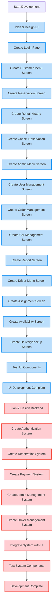

```mermaid
flowchart TD
    Start[Start Development]

    %% UI Development Phase (Blue)
    UIPlan[Plan & Design UI]
    LoginUI[Create Login Page]
    CustomerMenuUI[Create Customer Menu Screen]
    ReservationUI[Create Reservation Screen]
    HistoryUI[Create Rental History Screen]
    CancelUI[Create Cancel Reservation Screen]
    AdminMenuUI[Create Admin Menu Screen]
    UserMgmtUI[Create User Management Screen]
    OrderMgmtUI[Create Order Management Screen]
    CarMgmtUI[Create Car Management Screen]
    ReportUI[Create Report Screen]
    DriverMenuUI[Create Driver Menu Screen]
    AssignmentUI[Create Assignment Screen]
    AvailabilityUI[Create Availability Screen]
    DeliveryPickupUI[Create Delivery/Pickup Screen]
    UITest[Test UI Components]
    UIDone[UI Development Complete]

    %% System Development Phase (Red)
    SystemPlan[Plan & Design Backend]
    AuthSystem[Create Authentication System]
    ReservationSystem[Create Reservation System]
    PaymentSystem[Create Payment System]
    AdminSystem[Create Admin Management System]
    DriverSystem[Create Driver Management System]
    Integration[Integrate System with UI]
    SystemTest[Test System Components]
    DevDone[Development Complete]

    %% UI Flow Connections
    Start --> UIPlan
    UIPlan --> LoginUI
    LoginUI --> CustomerMenuUI
    CustomerMenuUI --> ReservationUI
    ReservationUI --> HistoryUI
    HistoryUI --> CancelUI
    CancelUI --> AdminMenuUI
    AdminMenuUI --> UserMgmtUI
    UserMgmtUI --> OrderMgmtUI
    OrderMgmtUI --> CarMgmtUI
    CarMgmtUI --> ReportUI
    ReportUI --> DriverMenuUI
    DriverMenuUI --> AssignmentUI
    AssignmentUI --> AvailabilityUI
    AvailabilityUI --> DeliveryPickupUI
    DeliveryPickupUI --> UITest
    UITest --> UIDone

    %% System Flow Connections
    UIDone --> SystemPlan
    SystemPlan --> AuthSystem
    AuthSystem --> ReservationSystem
    ReservationSystem --> PaymentSystem
    PaymentSystem --> AdminSystem
    AdminSystem --> DriverSystem
    DriverSystem --> Integration
    Integration --> SystemTest
    SystemTest --> DevDone

    %% Styling Classes
    classDef ui fill:#bbdefb,stroke:#2196f3,stroke-width:2px;
    classDef system fill:#ffcdd2,stroke:#f44336,stroke-width:2px;

    %% Assign UI classes
    class UIPlan,LoginUI,CustomerMenuUI,ReservationUI,HistoryUI,CancelUI,AdminMenuUI,UserMgmtUI,OrderMgmtUI,CarMgmtUI,ReportUI,DriverMenuUI,AssignmentUI,AvailabilityUI,DeliveryPickupUI,UITest,UIDone ui;

    %% Assign System classes
    class SystemPlan,AuthSystem,ReservationSystem,PaymentSystem,AdminSystem,DriverSystem,Integration,SystemTest,DevDone system;
```
