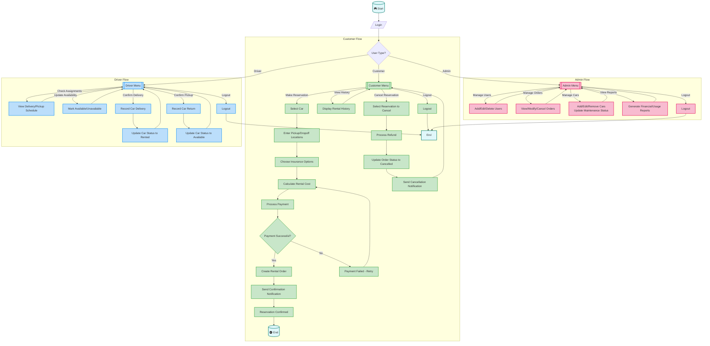

```mermaid
flowchart TD
    %% Start & Login
    Start[("fa:fa-car Start")]
    Login[/"Login"/]
    Start --> Login
    UserType{User Type?}
    Login --> UserType

    %% Customer Flow
    subgraph Customer_Flow[Customer Flow]
        CustomerMenu[[Customer Menu]]
        UserType -- Customer --> CustomerMenu

        %% Reservation Process
        CustomerMenu -- "Make Reservation" --> SelectCar[Select Car]
        SelectCar --> EnterLocation[Enter Pickup/Dropoff Locations]
        EnterLocation --> ChooseInsurance[Choose Insurance Options]
        ChooseInsurance --> CalculateCost[Calculate Rental Cost]
        CalculateCost --> ProcessPayment[Process Payment]
        ProcessPayment --> PaymentSuccess{Payment Successful?}
        PaymentSuccess -- Yes --> CreateOrder[Create Rental Order]
        CreateOrder --> SendNotification[Send Confirmation Notification]
        SendNotification --> Confirmation[Reservation Confirmed]
        Confirmation --> EndRental[("fa:fa-check-circle End")]
        PaymentSuccess -- No --> PaymentFailure[Payment Failed - Retry]
        PaymentFailure --> CalculateCost

        %% Other Customer Options
        CustomerMenu -- "View History" --> ViewHistory[Display Rental History]
        ViewHistory --> CustomerMenu

        CustomerMenu -- "Cancel Reservation" --> CancelReservation[Select Reservation to Cancel]
        CancelReservation --> ProcessRefund[Process Refund]
        ProcessRefund --> UpdateOrderStatus[Update Order Status to Cancelled]
        UpdateOrderStatus --> SendCancelNotif[Send Cancellation Notification]
        SendCancelNotif --> CustomerMenu

        CustomerMenu -- "Logout" --> LogoutC[Logout]
        LogoutC --> End
    end

    %% Admin Flow
    subgraph Admin_Flow[Admin Flow]
        AdminMenu[[Admin Menu]]
        UserType -- Admin --> AdminMenu

        AdminMenu -- "Manage Users" --> UserCRUD[Add/Edit/Delete Users]
        UserCRUD --> AdminMenu

        AdminMenu -- "Manage Orders" --> OrderCRUD[View/Modify/Cancel Orders]
        OrderCRUD --> AdminMenu

        AdminMenu -- "Manage Cars" --> CarCRUD[Add/Edit/Remove Cars<br>Update Maintenance Status]
        CarCRUD --> AdminMenu

        AdminMenu -- "View Reports" --> GenerateReports[Generate Financial/Usage Reports]
        GenerateReports --> AdminMenu

        AdminMenu -- "Logout" --> LogoutA[Logout]
        LogoutA --> End
    end

    %% Driver Flow
    subgraph Driver_Flow[Driver Flow]
        DriverMenu[[Driver Menu]]
        UserType -- Driver --> DriverMenu

        DriverMenu -- "Check Assignments" --> ViewAssignments[View Delivery/Pickup Schedule]
        ViewAssignments --> DriverMenu

        DriverMenu -- "Update Availability" --> ToggleAvailability[Mark Available/Unavailable]
        ToggleAvailability --> DriverMenu

        DriverMenu -- "Confirm Delivery" --> RecordDelivery[Record Car Delivery]
        RecordDelivery --> UpdateCarStatus[Update Car Status to Rented]
        UpdateCarStatus --> DriverMenu

        DriverMenu -- "Confirm Pickup" --> RecordPickup[Record Car Return]
        RecordPickup --> UpdateCarStatusReturn[Update Car Status to Available]
        UpdateCarStatusReturn --> DriverMenu

        DriverMenu -- "Logout" --> LogoutD[Logout]
        LogoutD --> End
    end

    %% Styling Classes for flows
    classDef customer fill:#c8e6c9,stroke:#4caf50,stroke-width:2px;
    classDef admin fill:#f8bbd0,stroke:#e91e63,stroke-width:2px;
    classDef driver fill:#bbdefb,stroke:#2196f3,stroke-width:2px;
    classDef startend fill:#e0f7fa,stroke:#00796b,stroke-width:2px;

    %% Assign classes to Customer Flow nodes
    class CustomerMenu,SelectCar,EnterLocation,ChooseInsurance,CalculateCost,ProcessPayment,PaymentSuccess,CreateOrder,SendNotification,Confirmation,PaymentFailure,ViewHistory,CancelReservation,ProcessRefund,UpdateOrderStatus,SendCancelNotif,LogoutC customer;
    
    %% Assign classes to Admin Flow nodes
    class AdminMenu,UserCRUD,OrderCRUD,CarCRUD,GenerateReports,LogoutA admin;
    
    %% Assign classes to Driver Flow nodes
    class DriverMenu,ViewAssignments,ToggleAvailability,RecordDelivery,UpdateCarStatus,RecordPickup,UpdateCarStatusReturn,LogoutD driver;
    
    %% Assign classes for start and end nodes
    class Start,End,EndRental startend;
```
